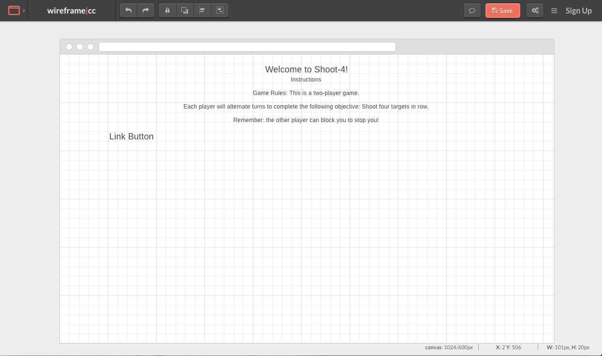
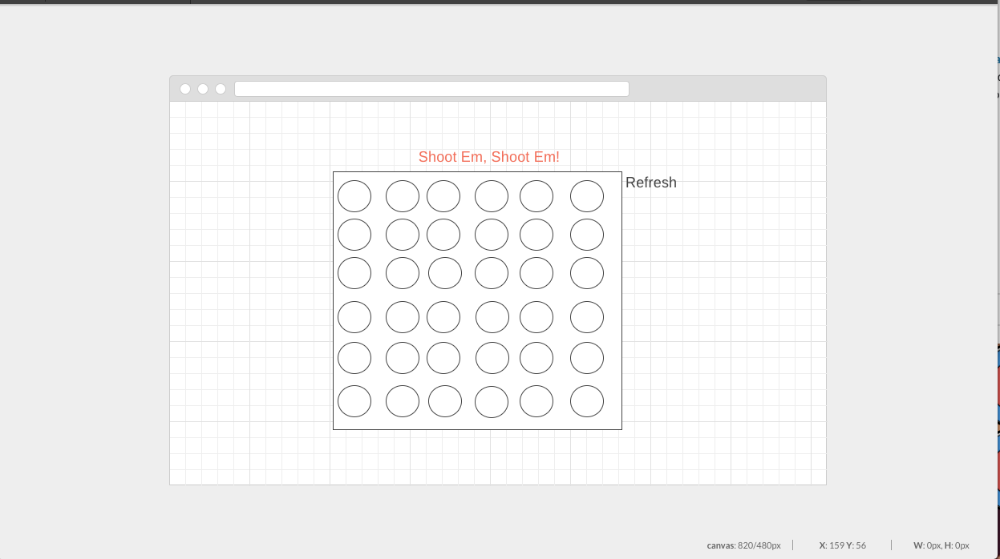

# Shoot-4
Write a project description
This is a 2-player game in which each player will alternate turns and complete the objective of connecting 4 targets
in the 6x6 game board. 

# Explanations of the technologies used:
- Used HTML, CSS, Javascript, and jquery 

# The approach taken:
Step 1: I had created a 6x6 gameboard in jquery to have a representation of the board. 
Step 2: Create the grid, I used a nested for loop to create a 6x6 grid and a click function to alternate between players.
Step 3: Then  conditional statements to check for the winners.
Step 4: A prompt box should pop up once a player has connect four in a row. 

# Unsolved problems:
+ Need to add more CSS properties to add flair!

# Wireframes images
;
;

